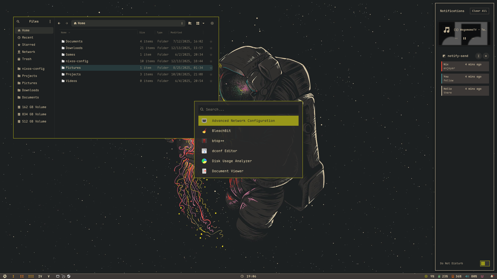
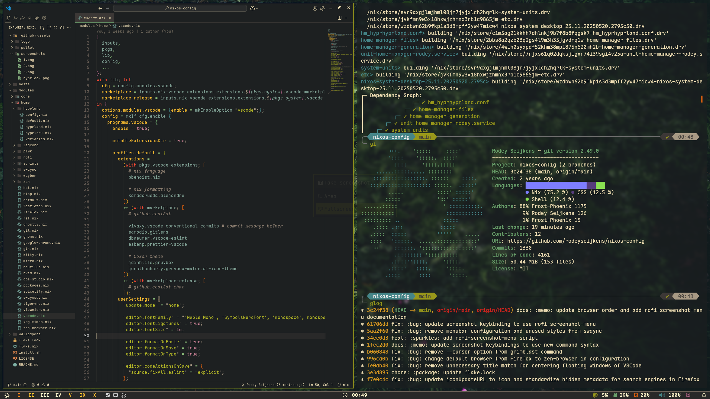
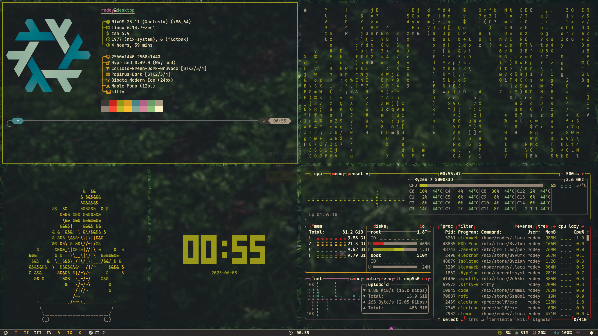
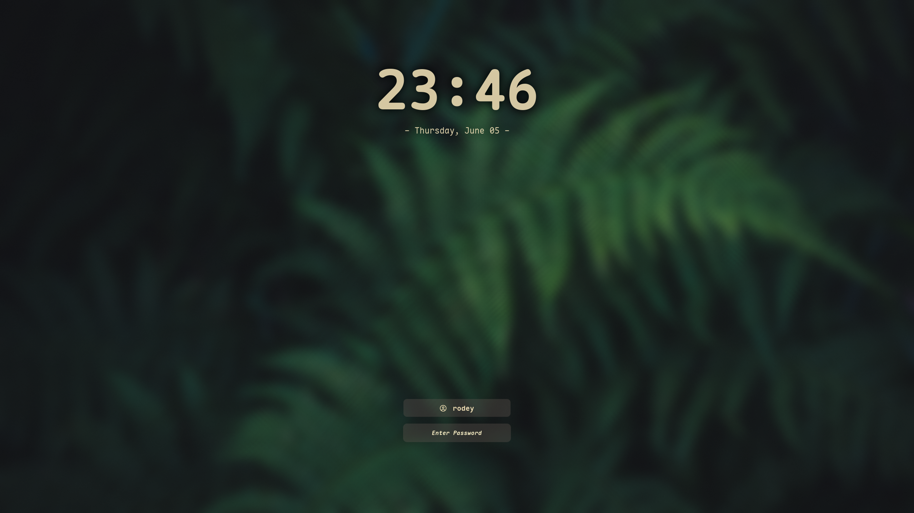

<h1 align="center">
    
   <br>
      Rodey's Flakes 
   <br>
       <br>

   <div align="center">
      <p></p>
      <div align="center">
         <a href="https://github.com/rodeyseijkens/nixos-config/stargazers">
            
         </a>
         <a href="https://github.com/rodeyseijkens/nixos-config/">
            
         </a>
         <a href="https://nixos.org">
            
         </a>
         <a href="https://github.com/rodeyseijkens/nixos-config/blob/main/LICENSE">
            
         </a>
      </div>
      <br>
   </div>
</h1>

### 🖼️ Gallery

<p align="center">
    <br>
    <br>
    <br>
   Screenshots last updated <b>2025-08-08</b>
</p>

<details>
<summary>
Hyprlock (EXPAND)
</summary>
<p align="center">
    <br>
</p>
</details>
<br/>
<br/>

# 🗃️ Overview

## 📚 Layout

- [flake.nix](flake.nix) base of the configuration
- [hosts](hosts) 🌳 per-host configurations that contain machine specific configurations
  - [desktop](hosts/desktop/) 🖥️ Desktop specific configuration
  - [desktop-office](hosts/desktop-office/) 🏢 Office desktop specific configuration
  - [desktop-work](hosts/desktop-work/) 🖥️ Work desktop specific configuration
  - [laptop](hosts/laptop/) 💻 Laptop specific configuration
  - [vm](hosts/vm/) 🗄️ VM specific configuration
- [modules](modules) 🍱 modularized NixOS configurations
  - [core](modules/core/) ⚙️ Core NixOS configuration
  - [home](modules/home/) 🏠 my [Home-Manager](https://github.com/nix-community/home-manager) config
- [wallpapers](wallpapers/) 🌄 wallpapers collection

## 📓 Components

|                             |                                  NixOS + Hyprland                                   |
| --------------------------- | :---------------------------------------------------------------------------------: |
| **Window Manager**          |                                [Hyprland][Hyprland]                                 |
| **Bar**                     |                                  [Waybar][Waybar]                                   |
| **Application Launcher**    |                                  [Walker][Walker]                                   |
| **Notification Daemon**     |                                  [swaync][swaync]                                   |
| **Terminal Emulator**       |                         [Kitty][Kitty] + [Ghostty][Ghostty]                         |
| **Shell**                   |                         [zsh][zsh] + [oh-my-zsh][oh-my-zsh]                         |
| **Text Editor**             |                [VSCode][VSCode] + [Neovim][Neovim] + [micro][micro]                 |
| **network management tool** | [NetworkManager][NetworkManager] + [network-manager-applet][network-manager-applet] |
| **System resource monitor** |                                    [Btop][Btop]                                     |
| **Browser**                 |                   [Zen Browser][zen-browser] + [Firefox][Firefox]                   |
| **File Manager**            |                         [Nautilus][Nautilus] + [yazi][yazi]                         |
| **Fonts**                   |                              [Maple Mono][Maple Mono]                               |
| **Color Scheme**            |                            [Gruvbox Dark Hard][Gruvbox]                             |
| **Cursor**                  |                       [Bibata-Modern-Ice][Bibata-Modern-Ice]                        |
| **Icons**                   |                            [Papirus-Dark][Papirus-Dark]                             |
| **Lockscreen**              |                                [Hyprlock][Hyprlock]                                 |
| **Image Viewer**            |                                [viewnior][viewnior]                                 |
| **Media Player**            |                                     [mpv][mpv]                                      |
| **Screenshot Software**     |                               [grimblast][grimblast]                                |
| **Screen Recording**        |                             [wf-recorder][wf-recorder]                              |
| **Color Picker**            |                              [hyprpicker][hyprpicker]                               |
| **Theme Manager**           |                                  [Stylix][Stylix]                                   |

## 📝 Shell aliases

<details>
<summary>
Utils (EXPAND)
</summary>

- `c` $\rightarrow$ `clear`
- `cd` $\rightarrow$ `z`
- `cat` $\rightarrow$ `bat`
- `nano` $\rightarrow$ `micro`
- `code` $\rightarrow$ `code`
- `diff` $\rightarrow$ `delta --diff-so-fancy --side-by-side`
- `less` $\rightarrow$ `bat`
- `y` $\rightarrow$ `yazi`
- `py` $\rightarrow$ `python`
- `ipy` $\rightarrow$ `ipython`
- `icat` $\rightarrow$ `kitten icat`
- `dsize` $\rightarrow$ `du -hs`
- `pdf` $\rightarrow$ `tdf`
- `open` $\rightarrow$ `xdg-open`
- `space` $\rightarrow$ `ncdu`
- `man` $\rightarrow$ `BAT_THEME='default' batman`
- `l` $\rightarrow$ `eza --icons  -a --group-directories-first -1`
- `ll` $\rightarrow$ `eza --icons  -a --group-directories-first -1 --no-user --long`
- `tree` $\rightarrow$ `eza --icons --tree --group-directories-first`
</details>

<details>
<summary>
Nixos (EXPAND)
</summary>

- `cdnix` $\rightarrow$ `cd ~/nixos-config && code ~/nixos-config`
- `ns` $\rightarrow$ `nom-shell --run zsh`
- `nix-test` $\rightarrow$ `nh os test`
- `nix-switch` $\rightarrow$ `nh os switch`
- `nix-update` $\rightarrow$ `nh os switch --update`
- `nix-clean` $\rightarrow$ `nh clean all --keep 5`
- `nix-search` $\rightarrow$ `nh search`
</details>

<details>
<summary>
Git (EXPAND)
</summary>

**Tools:**

- `g` $\rightarrow$ `lazygit && clear`
- `gi` $\rightarrow$ `onefetch --number-of-file-churns 0 --no-color-palette`

**Status/Log:**

- `gs` $\rightarrow$ `git status`
- `gd` $\rightarrow$ `git diff`
- `glog` $\rightarrow$ `git log --oneline --decorate --graph`
- `glol` $\rightarrow$ `git log --graph --pretty='%Cred%h%Creset -%C(auto)%d%Creset %s %Cgreen(%ar) %C(bold blue)<%an>%Creset'`
- `glola` $\rightarrow$ `git log --graph --pretty='%Cred%h%Creset -%C(auto)%d%Creset %s %Cgreen(%ar) %C(bold blue)<%an>%Creset' --all`
- `glols` $\rightarrow$ `git log --graph --pretty='%Cred%h%Creset -%C(auto)%d%Creset %s %Cgreen(%ar) %C(bold blue)<%an>%Creset' --stat`

**Stage/Commit:**

- `ga` $\rightarrow$ `git add`
- `gaa` $\rightarrow$ `git add --all`
- `gc` $\rightarrow$ `git commit`
- `gcm` $\rightarrow$ `git commit -m`
- `gca` $\rightarrow$ `git commit --amend`
- `gcaa` $\rightarrow$ `git add --all && git commit --amend --no-edit`
- `gcz` $\rightarrow$ `git cz`
- `gcfu` $\rightarrow$ `git commit --fixup HEAD`
- `gcma` $\rightarrow$ `git add --all && git commit -m`
- `gcza` $\rightarrow$ `git add --all && git cz`
- `gcfua` $\rightarrow$ `git add --all && git commit --fixup HEAD`
- `ggcm` $\rightarrow$ `commit-gen -c`
- `ggmcw` $\rightarrow$ `commit-gen -c -w`

**History:**

- `gb` $\rightarrow$ `git branch`
- `gch` $\rightarrow$ `git checkout`
- `gchb` $\rightarrow$ `git checkout -b`
- `grb` $\rightarrow$ `git rebase`

**Sync:**

- `gf` $\rightarrow$ `git fetch`
- `gfp` $\rightarrow$ `git fetch --prune`
- `gpl` $\rightarrow$ `git pull`
- `gplo` $\rightarrow$ `git pull origin`
- `gps` $\rightarrow$ `git push`
- `gpsf` $\rightarrow$ `git push --force`
- `gpso` $\rightarrow$ `git push origin`
- `gpst` $\rightarrow$ `git push --follow-tags`
- `gcl` $\rightarrow$ `git clone`

**Misc:**

- `gtag` $\rightarrow$ `git tag -ma`
- `gm` $\rightarrow$ `git merge`

</details>

## 🛠️ Scripts

All the scripts are in `modules/home/scripts/scripts/` and are exported as packages in `modules/home/scripts/default.nix`

<details>
<summary>
ascii.sh 
</summary>

**Description:** This script displays a comprehensive ASCII character table showing decimal, hexadecimal, and character representations in a formatted table layout.

**Usage:** `ascii`

</details>

<details>
<summary>
compress.sh 
</summary>

**Description:** This script compresses a file or a folder into a `tar.gz` archive which is created in the current directory with the name of the chosen file or folder.

**Usage:** `compress <file>` or `compress <folder>`

</details>

<details>
<summary>
commit-gen.sh 
</summary>

**Description:** This script generates commit messages using the LLM command following Conventional Commits format with gitmoji and scopes. It can analyze staged changes, all changes, or untracked files and automatically generate appropriate commit messages.

**Usage:** `commit-gen` with various options:

**Options:**

- `-h, --help` - Show help message
- `-m, --model` - Specify LLM model (uses llm's configured default if not specified)
- `-p, --print` - Print generated message only (no commit)
- `-s, --staged` - Analyze staged changes only
- `-c, --commit` - Automatically commit without confirmation
- `-w, --workspace` - Specify scope for commit message
- `-D, --debug` - Show verbose output

**Examples:**

- `commit-gen` - Interactive mode analyzing all changes
- `commit-gen -s` - Analyze staged changes only
- `commit-gen -c` - Auto-commit all changes
- `commit-gen -p -s` - Print message for staged changes
- `commit-gen -w frontend` - Use 'frontend' as scope

</details>

<details>
<summary>
extract.sh 
</summary>

**Description:** This script extracts `tar.gz` archives in the current directory.

**Usage:** `extract <archive_file>`

</details>

<details>
<summary>
google-chrome-profile.sh 
</summary>

**Description:** This script launches Google Chrome with a specific profile by name, automatically finding the correct profile directory.

**Usage:** `google-chrome-profile <profile_name> [additional_args]`

</details>

<details>
<summary>
list-audio-devices.sh 
</summary>

**Description:** This script lists all available audio devices including cards, output devices (sinks), and input devices (sources) with clear categorization and device information.

**Usage:** `list-audio-devices`

</details>

<details>
<summary>
lofi.sh 
</summary>

**Description:** This script toggles a lo-fi music stream. If mpv is already playing, it kills the process; otherwise, it starts playing a lo-fi YouTube stream in the background.

**Usage:** `lofi`

</details>

<details>
<summary>
poolsuite.sh 
</summary>

**Description:** This script toggles a poolsuite music playlist. If mpv is already playing, it kills the process; otherwise, it starts playing a poolsuite YouTube playlist in shuffle mode.

**Usage:** `poolsuite`

</details>

<details>
<summary>
record.sh 
</summary>

**Description:** This script provides screen recording functionality with options to record as MP4 or GIF format, with the ability to select recording area and output optimization.

**Usage:** `record`

</details>

<details>
<summary>
power-menu.sh 
</summary>

**Description:** This script provides a Walker-based power menu with options to shutdown, reboot, or lock the system with confirmation dialogs.

**Usage:** `power-menu`

</details>

<details>
<summary>
screenshot-menu.sh 
</summary>

**Description:** This script provides a Walker-based menu for taking screenshots with multiple capture modes and clipboard functionality. All capture modes automatically copy screenshots to the clipboard for immediate use.

**Usage:** `screenshot-menu`

**Options:**

- 📷 **Area** - Select an area and copy directly to clipboard
- 🖥️ **Fullscreen** - Capture entire screen and copy to clipboard
- 💾 **Save to File** - Choose between area or fullscreen capture and save to `~/Pictures/Screenshots/`
- ✏️ **Edit with Satty** - Capture and save, then open in Satty image editor
- ⏰ **Timer** - Delayed fullscreen capture (5s or 10s countdown) and save to file

</details>

<details>
<summary>
runbg.sh 
</summary>

**Description:** This script runs a provided command along with its arguments and detaches it from the terminal. Handy for launching apps from the command line without blocking it.

**Usage:** `runbg <command> <arg1> <arg2> <...>`

</details>

<details>
<summary>
screenshot.sh 
</summary>

**Description:** This script provides basic screenshot functionality with options to copy to clipboard, save to file, or edit with Satty. Screenshots are saved to `~/Pictures/Screenshots/`.

**Usage:** `screenshot --copy` or `screenshot --save` or `screenshot --satty`

</details>

<details>
<summary>
toggle-blur.sh 
</summary>

**Description:** This script toggles the Hyprland blur effect. If the blur is currently enabled, it will be disabled, and if it's disabled, it will be turned on.

**Usage:** `toggle-blur`

</details>

<details>
<summary>
toggle-float.sh 
</summary>

**Description:** This script toggles the floating state of the current window in Hyprland. If the window is currently tiled, it will be floated, and if it's floating, it will be tiled.

**Usage:** `toggle-float`

</details>

<details>
<summary>
toggle-opacity.sh 
</summary>

**Description:** This script toggles the Hyprland opacity effect. If the opacity is currently set to 0.90, it will be set to 1, and if it's set to 1, it will be set to 0.90.

**Usage:** `toggle-opacity`

</details>

<details>
<summary>
toggle-waybar.sh 
</summary>

**Description:** This script toggles the visibility of the Waybar status bar. If Waybar is currently visible, it will be hidden, and if it's hidden, it will be shown.

**Usage:** `toggle-waybar`

</details>

<details>
<summary>
wall-change.sh 
</summary>

**Description:** This script changes the wallpaper using swww with random transition effects (either any transition type or a wipe transition with 135-degree angle).

**Usage:** `wall-change <wallpaper_path>`

</details>

## ⌨️ Keybinds

By default `$mainMod` is the `SUPER` key.

<details>
<summary>
Keybindings 
</summary>

##### keybindings

- `$mainMod, Return, exec, [float; center; size 50% 50%] kitty`
- `$mainMod SHIFT, Return, exec, kitty`
- `$mainMod ALT, Return, exec, [fullscreen] kitty`
- `$mainMod, B, exec, zen-beta`
- `$mainMod, Q, killactive,`
- `$mainMod, F, fullscreen, 0`
- `$mainMod SHIFT, F, fullscreen, 1`
- `$mainMod, G, exec, toggle-float`
- `$mainMod, Space, exec, walker`
- `CTRL, Space, exec, walker`
- `$mainMod SHIFT, D, exec, legcord --enable-features=UseOzonePlatform --ozone-platform=wayland`
- `$mainMod SHIFT, Escape, exec, walker-menu power`
- `$mainMod, P, pseudo,`
- `$mainMod, X, togglesplit,`
- `$mainMod, T, exec, toggle-opacity`
- `$mainMod, E, exec, nautilus`
- `$mainMod SHIFT, B, exec, toggle-waybar`
- `$mainMod, C, exec, hyprpicker -a`
- `$mainMod, W, exec, walker-menu wallpapers`
- `$mainMod, N, exec, swaync-client -t -sw`

##### screenshot

- `,Print, exec, walker-menu screenshot`
- `$mainMod, Print, exec, screenshot --save`
- `$mainMod SHIFT, Print, exec, screenshot --satty`

##### switch focus

- `$mainMod, left, movefocus, l`
- `$mainMod, right, movefocus, r`
- `$mainMod, up, movefocus, u`
- `$mainMod, down, movefocus, d`
- `$mainMod, h, movefocus, l`
- `$mainMod, j, movefocus, d`
- `$mainMod, k, movefocus, u`
- `$mainMod, l, movefocus, r`

##### switch workspace

- `$mainMod, 1, workspace, 1`
- `$mainMod, 2, workspace, 2`
- `$mainMod, 3, workspace, 3`
- `$mainMod, 4, workspace, 4`
- `$mainMod, 5, workspace, 5`
- `$mainMod, 6, workspace, 6`
- `$mainMod, 7, workspace, 7`
- `$mainMod, 8, workspace, 8`
- `$mainMod, 9, workspace, 9`
- `$mainMod, 0, workspace, 10`

##### same as above, but move to the workspace

- `$mainMod SHIFT, 1, movetoworkspacesilent, 1 # movetoworkspacesilent`
- `$mainMod SHIFT, 2, movetoworkspacesilent, 2`
- `$mainMod SHIFT, 3, movetoworkspacesilent, 3`
- `$mainMod SHIFT, 4, movetoworkspacesilent, 4`
- `$mainMod SHIFT, 5, movetoworkspacesilent, 5`
- `$mainMod SHIFT, 6, movetoworkspacesilent, 6`
- `$mainMod SHIFT, 7, movetoworkspacesilent, 7`
- `$mainMod SHIFT, 8, movetoworkspacesilent, 8`
- `$mainMod SHIFT, 9, movetoworkspacesilent, 9`
- `$mainMod SHIFT, 0, movetoworkspacesilent, 10`
- `$mainMod CTRL, c, movetoworkspace, empty`

##### window control

- `$mainMod SHIFT, left, movewindoworgroup, l`
- `$mainMod SHIFT, right, movewindoworgroup, r`
- `$mainMod SHIFT, up, movewindoworgroup, u`
- `$mainMod SHIFT, down, movewindoworgroup, d`
- `$mainMod SHIFT, h, movewindoworgroup, l`
- `$mainMod SHIFT, j, movewindoworgroup, d`
- `$mainMod SHIFT, k, movewindoworgroup, u`
- `$mainMod SHIFT, l, movewindoworgroup, r`

- `$mainMod CTRL, left, resizeactive, -80 0`
- `$mainMod CTRL, right, resizeactive, 80 0`
- `$mainMod CTRL, up, resizeactive, 0 -80`
- `$mainMod CTRL, down, resizeactive, 0 80`
- `$mainMod CTRL, h, resizeactive, -80 0`
- `$mainMod CTRL, j, resizeactive, 0 80`
- `$mainMod CTRL, k, resizeactive, 0 -80`
- `$mainMod CTRL, l, resizeactive, 80 0`

- `$mainMod ALT, left, moveactive,  -80 0`
- `$mainMod ALT, right, moveactive, 80 0`
- `$mainMod ALT, up, moveactive, 0 -80`
- `$mainMod ALT, down, moveactive, 0 80`
- `$mainMod ALT, h, moveactive,  -80 0`
- `$mainMod ALT, j, moveactive, 0 80`
- `$mainMod ALT, k, moveactive, 0 -80`
- `$mainMod ALT, l, moveactive, 80 0`

#### window tabbed grouping

- `$mainMod SHIFT, T, togglegroup # toggle tabbed group`
- `$mainMod ALT, left, changegroupactive, b # change active tab back`
- `$mainMod ALT, right, changegroupactive, f # change active tab forward`
- `$mainMod ALT, j, changegroupactive, b # change active tab back`
- `$mainMod ALT, l, changegroupactive, f # change active tab forward`

#### mouse bindings

- `$mainMod, mouse:274, movewindow`
- `$mainMod SHIFT, mouse:274, resizewindow`

##### media and volume controls

- `,XF86AudioPlay,exec, playerctl play-pause`
- `,XF86AudioNext,exec, playerctl next`
- `,XF86AudioPrev,exec, playerctl previous`
- `,XF86AudioStop, exec, playerctl stop`
- `$mainMod, mouse_down, workspace, e-1`
- `$mainMod, mouse_up, workspace, e+1`
</details>

# 🚀 Installation

> [!CAUTION]
> Applying custom configurations, especially those related to your operating system, can have unexpected consequences and may interfere with your system's normal behavior. While I have tested these configurations on my own setup, there is no guarantee that they will work flawlessly for you.
> **I am not responsible for any issues that may arise from using this configuration.**

> [!NOTE]
> It is highly recommended to review the configuration contents and make necessary modifications to customize it to your needs before attempting the installation.

#### 1. **Install NixOs**

First install nixos using any [graphical ISO image](https://nixos.org/download.html#nixos-iso).

> [!NOTE]
> Only been tested using the Gnome graphical installer and choosing the `No desktop` option during installation.

#### 2. **Clone the repo**

```bash
nix-shell -p git
git clone https://github.com/rodeyseijkens/nixos-config
cd nixos-config
```

#### 3. **Install script**

> [!CAUTION]
> For some computers, the default rebuild command might get stuck due to CPU cores running out of RAM. To fix that modify the install script line: `sudo nixos-rebuild switch --flake .#${HOST}` to `sudo nixos-rebuild switch --cores <less than your max number of cores> --flake .#${HOST}`

> [!TIP]
> As it is better to know what a script does before running it, you are advised to read it or at least see the [Install script walkthrough](#install-script-walkthrough) section before execution.

Execute and follow the installation script :

```bash
./install.sh
```

#### 4. **Reboot**

After rebooting, the config should be applied, you'll be greeted by hyprlock prompting for your password.

#### 5. **Manual config**

Even though I use home manager and Stylix for automated theming, there is still a little bit of manual configuration to do:

- Enable Discord theme (in Discord settings under VENCORD > Themes).
- Configure the browser (some browser configuration is done automatically for firefox & zen).
- Change the git account information in `./modules/home/git.nix`

```nix
programs.git = {
   ...
   userName = "rodeyseijkens";
   userEmail = "me@rodey.nl";
   ...
};
```

**Note:** With the addition of Stylix, most theming is handled automatically across the system, including colors, fonts, and icons. The system will consistently apply the theme to supported applications.

## Install script walkthrough

A brief walkthrough of what the install script does.

#### 1. **Get username**

You will receive a prompt to enter your username, with a confirmation check.

#### 2. **Set username**

The script will replace all occurrences of the default username `CURRENT_USERNAME` by the given one stored in `$username`

#### 3. Create basic directories

The following directories will be created:

- `~/Downloads`
- `~/Documents`
- `~/Pictures`
- `~/Projects`

#### 4. Get the hardware configuration

It will also automatically copy the hardware configuration from `/etc/nixos/hardware-configuration.nix` to `./hosts/${host}/hardware-configuration.nix` so that the hardware configuration used is yours and not the default one.

#### 5. Choose a host (desktop / desktop-office / desktop-work / laptop / vm)

Now you will need to choose the host you want. It depends on whether you are using a desktop, office desktop, work desktop, laptop, or VM (although VM can be really buggy).

#### 6. Build the system

Lastly, it will build the system using [nh](https://github.com/viperML/nh), which includes both the flake config and home-manager config.

# 🔧 Troubleshooting & Extra Info

### Volta

**Description:** Volta is a JavaScript tool manager that allows you to easily install and switch between different versions of Node.js, npm, and other JavaScript command-line tools.

**Issue:** Tool installed via Volta but not available in PATH

**Solution:**

1. Remove the Volta directory from your home folder:
   ```bash
   rm -rf ~/.volta
   ```
2. Reinstall the tool using Volta:
   ```bash
   volta install <tool-name>
   ```

This will reset Volta's local configuration and properly reinstall the tool with correct PATH integration.

# 👥 Credits

Special thanks to **Frost-Phoenix**

I forked this project from: [Frost-Phoenix/nixos-config](https://github.com/Frost-Phoenix/nixos-config)

Other dotfiles that I learned / copy from:

- Nix Flakes

  - [nomadics9/NixOS-Flake](https://github.com/nomadics9/NixOS-Flake)
  - [samiulbasirfahim/Flakes](https://github.com/samiulbasirfahim/Flakes): General flake / files structure
  - [justinlime/dotfiles](https://github.com/justinlime/dotfiles): Mainly waybar (old design)
  - [skiletro/nixfiles](https://github.com/skiletro/nixfiles): Vscodium config (that prevent it to crash)
  - [fufexan/dotfiles](https://github.com/fufexan/dotfiles)
  - [mrh/dotfiles](https://codeberg.org/mrh/dotfiles): base waybar config

- README
  - [ryan4yin/nix-config](https://github.com/ryan4yin/nix-config)
  - [NotAShelf/nyx](https://github.com/NotAShelf/nyx)
  - [sioodmy/dotfiles](https://github.com/sioodmy/dotfiles)
  - [Ruixi-rebirth/flakes](https://github.com/Ruixi-rebirth/flakes)

<!-- # ✨ Stars History -->

<!-- <p align="center"></p> -->

<!-- end of page, send back to the top -->

<div align="right">
  <a href="#readme">Back to the Top</a>
</div>

<!-- Links -->

[Hyprland]: https://github.com/hyprwm/Hyprland
[Kitty]: https://sw.kovidgoyal.net/kitty/
[Ghostty]: https://ghostty.org/
[Waybar]: https://github.com/Alexays/Waybar
[Btop]: https://github.com/aristocratos/btop
[Nautilus]: https://apps.gnome.org/Nautilus/
[yazi]: https://github.com/sxyazi/yazi
[zsh]: https://www.zsh.org/
[oh-my-zsh]: https://ohmyz.sh/
[Hyprlock]: https://github.com/hyprwm/hyprlock
[mpv]: https://github.com/mpv-player/mpv
[VSCode]: https://code.visualstudio.com/
[Neovim]: https://github.com/neovim/neovim
[grimblast]: https://github.com/hyprwm/contrib
[swaync]: https://github.com/ErikReider/SwayNotificationCenter
[NetworkManager]: https://wiki.gnome.org/Projects/NetworkManager
[network-manager-applet]: https://gitlab.gnome.org/GNOME/network-manager-applet/
[wf-recorder]: https://github.com/ammen99/wf-recorder
[hyprpicker]: https://github.com/hyprwm/hyprpicker
[Gruvbox]: https://github.com/morhetz/gruvbox
[Papirus-Dark]: https://github.com/PapirusDevelopmentTeam/papirus-icon-theme
[Bibata-Modern-Ice]: https://www.gnome-look.org/p/1197198
[Firefox]: https://www.mozilla.org
[zen-browser]: https://github.com/zen-browser/desktop
[Maple Mono]: https://github.com/subframe7536/maple-font
[micro]: https://micro-editor.github.io/
[viewnior]: https://siyanpanayotov.com/project/viewnior
[Stylix]: https://github.com/danth/stylix
[Walker]: https://github.com/abenz1267/walker
